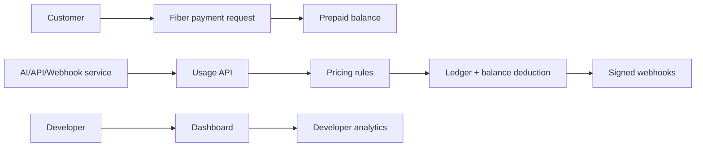

# FiberMeter

**FiberMeter — usage-based billing and prepaid service-metering infrastructure for Fiber Network.**

FiberMeter is an open-source infrastructure layer for developers building paid APIs, AI tools, webhook products, subscriptions, and usage-based services on Fiber Network. It combines prepaid balances, pricing rules, usage metering, payment requests, append-only ledger entries, webhook delivery, SDKs, and dashboards.

## Problem

Fiber builders should not have to rebuild billing, balance accounting, usage metering, idempotency, payment-state tracking, and webhook notifications for every merchant or service.

## Solution

FiberMeter provides reusable Stripe-Billing-like infrastructure, but Fiber-native: customers pre-fund balances with Fiber payment requests, services report usage, FiberMeter calculates charges, deducts balances, records ledger entries, and emits signed webhooks.



## MVP features

- Express + TypeScript API with Prisma/PostgreSQL schema.
- Developer auth, JWT dashboard APIs, hashed API keys for ingestion.
- Metered services, pricing rules, customers, balances, payment requests, usage events, ledger entries, and webhook delivery logs.
- Simulated Fiber payment provider plus live-provider placeholder.
- React dashboard and AI Summary demo app shells.
- TypeScript SDK with `recordUsage`, `createCustomer`, `createPaymentRequest`, `getBalance`, and webhook verification.
- Hackathon-ready docs and submission writeup.

## Local setup

```bash
pnpm install
docker compose up -d postgres
cp apps/api/.env.example apps/api/.env
pnpm --filter @fibermeter/api prisma:generate
pnpm --filter @fibermeter/api prisma:migrate
pnpm --filter @fibermeter/api seed
pnpm dev
```

Demo login: `demo@fibermeter.dev` / `password123`.

## API example

```bash
curl -X POST http://localhost:4000/api/usage-events \
  -H "x-api-key: fm_demo" \
  -H "content-type: application/json" \
  -d '{"service":"ai-summary","customer":"cus_demo_001","metricKey":"tokens","quantity":1250,"idempotencyKey":"req_123"}'
```

## SDK example

```ts
import { FiberMeter } from '@fibermeter/sdk'

const meter = new FiberMeter({ apiKey: process.env.FIBERMETER_API_KEY, baseUrl: 'http://localhost:4000' })
await meter.recordUsage({ service: 'ai-summary', customer: 'cus_demo_001', metricKey: 'tokens', quantity: 1250, idempotencyKey: 'req_123' })
```

## Webhooks

FiberMeter signs payloads with HMAC SHA-256 and sends `X-FiberMeter-Event`, `X-FiberMeter-Signature`, and `X-FiberMeter-Timestamp` headers.

## Screenshots

- Dashboard overview: `docs/screenshots/dashboard-overview.png` placeholder.
- AI Summary demo: `docs/screenshots/demo-service.png` placeholder.

## Hackathon category fit

Category: **Merchant, Liquidity, LSP, and Multi-Asset Infrastructure**. FiberMeter is not a consumer checkout app; it is reusable billing and metering infrastructure for merchants, services, wallets, and developers building on Fiber.

## Roadmap

Live Fiber settlement verification, multi-asset support beyond CKB, hosted webhook workers, invoice exports, billing portals, wallet connectors, and production-grade observability.

## License

MIT.
