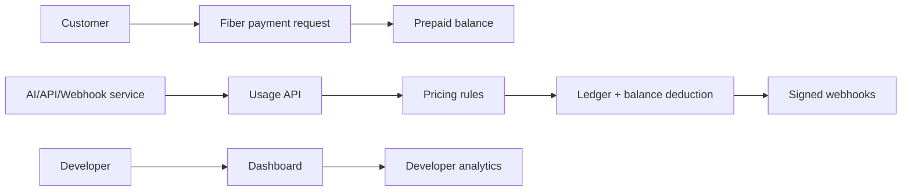
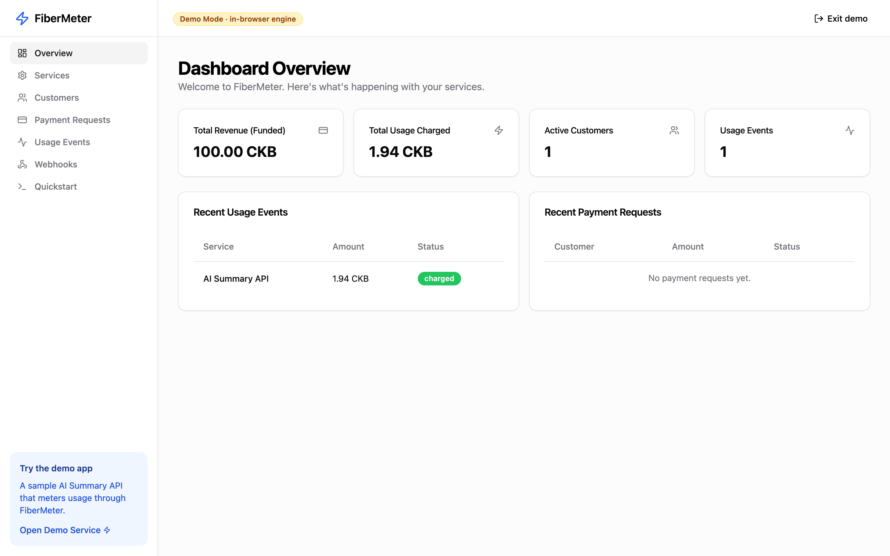
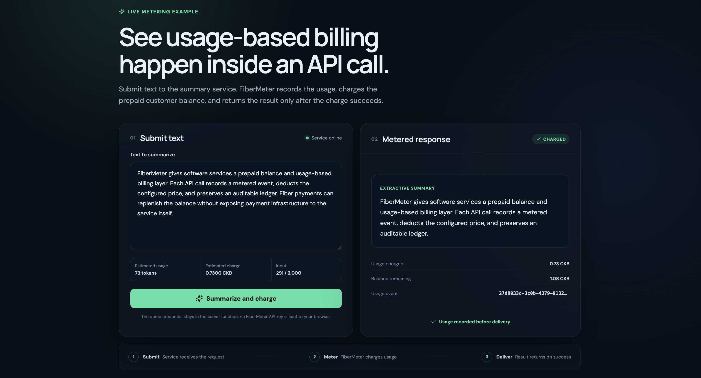

# FiberMeter

**FiberMeter — usage-based billing and prepaid service-metering infrastructure for Fiber Network.**

FiberMeter is an open-source infrastructure layer for developers building paid APIs, AI tools, webhook products, subscriptions, and usage-based services on Fiber Network. It combines prepaid balances, pricing rules, usage metering, payment requests, append-only ledger entries, webhook delivery, SDKs, and dashboards.

## Problem

Fiber builders should not have to rebuild billing, balance accounting, usage metering, idempotency, payment-state tracking, and webhook notifications for every merchant or service.

## Solution

FiberMeter provides reusable Stripe-Billing-like infrastructure, but Fiber-native: customers pre-fund balances with Fiber payment requests, services report usage, FiberMeter calculates charges, deducts balances, records ledger entries, and emits signed webhooks.



## MVP features

- Express + TypeScript API with Prisma/PostgreSQL schema.
- Developer auth, JWT dashboard APIs, hashed API keys for ingestion.
- Metered services, pricing rules, customers, balances, payment requests, usage events, ledger entries, and webhook delivery logs.
- Simulated Fiber provider by default, plus a live provider that creates real
  invoices and verifies Fiber settlement through node RPC.
- **Payment preflight (PayReady)** — `POST /api/fiber/preflight` checks node health, invoice validity, peers, liquidity, and dry-run route before `send_payment`. Dashboard page: **Preflight**.
- Judge-ready live funding dialog with an invoice QR, bounded testnet demo payer,
  automatic settlement detection, and a manual node fallback.
- Polished React dashboard (services, pricing rules, customers, balances, payment
  requests, usage events, webhooks, quickstart) that runs against the **live API**
  or a fully **in-browser demo** engine — selectable at login.
- AI Summary demo app that meters usage through FiberMeter end-to-end.
- TypeScript SDK with `recordUsage`, `createCustomer`, `createPaymentRequest`, `getBalance`, and webhook verification.
- Hackathon-ready docs, submission writeup, and phased [ROADMAP](ROADMAP.md).

## Run it (one command)

Everything below runs against the **simulated** Fiber provider by default, so the
full flow — payment requests, **Simulate Paid**, balance funding, usage metering,
ledger, webhooks — works with **zero external dependencies**: no Fiber node, no
faucet, no channels. (Real on-chain Fiber is optional — see
[docs/08-fiber-integration.md](docs/08-fiber-integration.md).)

### Option A — Docker (recommended)

Brings up Postgres + API + dashboard + demo service. The API auto-migrates and
seeds demo data on boot.

```bash
docker compose up
```

- Dashboard → http://localhost:5173
- Demo app → http://localhost:5174
- API → http://localhost:4000

(First run builds the images — a few minutes.)

### Option B — Script (needs pnpm; Docker only for Postgres)

```bash
pnpm bootstrap   # install deps, start Postgres, migrate + seed
pnpm dev         # run dashboard (5173) + demo app (5174) + API (4000)
```

`pnpm bootstrap` uses an existing PostgreSQL on `:5432` if present, otherwise
starts one with `docker compose up -d postgres`.

### Zero-install preview

The dashboard's **demo mode** runs the whole billing engine in the browser — no
backend at all. Open http://localhost:5173 and click **Explore in demo mode**.

Dashboard login (live mode): `demo@fibermeter.dev` / `password123`.

## Dashboard (Live + Demo modes)

The dashboard (`apps/dashboard`) can be explored two ways:

- **Live** — sign in as the seeded developer (`demo@fibermeter.dev` /
  `password123`) and the dashboard reads/writes the real API over JWT.
- **Demo** — click **Explore in demo mode** to run the entire billing engine
  in the browser. No backend, database, or seed required — ideal for a quick
  look or an offline demo video.

```bash
# Zero-backend preview:
pnpm --filter @fibermeter/dashboard dev   # then choose "Explore in demo mode"
```

A badge in the header always shows which mode is active. In Live mode, create an
API key on the **Quickstart** page — the Demo Service uses it to ingest usage.

## API example

```bash
curl -X POST http://localhost:4000/api/usage-events \
  -H "x-api-key: fm_demo" \
  -H "content-type: application/json" \
  -d '{"service":"ai-summary","customer":"cus_demo_001","metricKey":"tokens","quantity":1250,"idempotencyKey":"req_123"}'
```

## SDK example

```ts
import { FiberMeter } from '@fibermeter/sdk';

const meter = new FiberMeter({
  apiKey: process.env.FIBERMETER_API_KEY,
  baseUrl: 'http://localhost:4000',
});
await meter.recordUsage({
  service: 'ai-summary',
  customer: 'cus_demo_001',
  metricKey: 'tokens',
  quantity: 1250,
  idempotencyKey: 'req_123',
});
```

## Webhooks

FiberMeter signs payloads with HMAC SHA-256 and sends `X-FiberMeter-Event`, `X-FiberMeter-Signature`, and `X-FiberMeter-Timestamp` headers.

## Testing

```bash
pnpm --filter @fibermeter/api test
```

Covers pricing calculation, HMAC webhook signatures, and — as integration tests
against Postgres — balance funding, usage charging, insufficient-balance handling,
and idempotency. The integration tests run when a migrated database is reachable
via `DATABASE_URL` (e.g. after `docker compose up -d postgres`) and skip cleanly
otherwise, so `pnpm test` is safe to run anywhere.

## Screenshots

**Dashboard overview** — services, prepaid balances, and recent metered usage:



**AI Summary demo** — a metered service charging a prepaid Fiber balance per usage:



More: [services](docs/screenshots/services.png) ·
[usage events](docs/screenshots/usage-events.png) ·
[webhooks](docs/screenshots/webhooks.png).

Live demo operation: [zero-setup auto-payer](docs/11-live-hosted-demo.md) ·
[native Ubuntu/TinyCP deployment](deploy/native/README.md).

## Hackathon category fit

Category: **Merchant, Liquidity, LSP, and Multi-Asset Infrastructure**. FiberMeter is not a consumer checkout app; it is reusable billing and metering infrastructure for merchants, services, wallets, and developers building on Fiber.

## Roadmap

See [ROADMAP.md](ROADMAP.md) for the full phased plan — from the hackathon MVP
(Phase 0) through live Fiber settlement, production hardening, multi-tenancy/RBAC,
subscriptions and tiered pricing, real-time analytics, an SDK ecosystem, scale,
and go-to-market.

## License

MIT.
